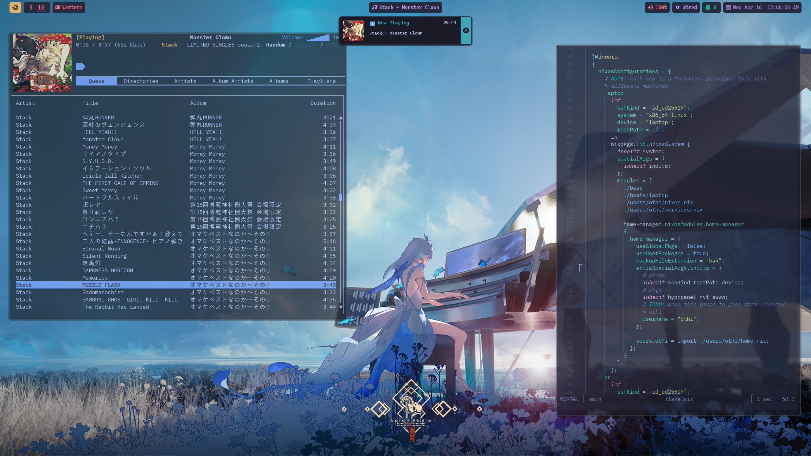
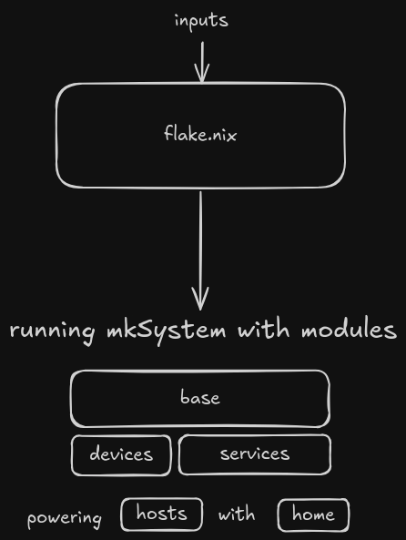

    <h1>
      Othi's dotfiles (NixOS edition)
    </h1>
    <picture>
      
    </picture>
    
      <i>
        <a href="https://x.com/void_ling/status/1855164935141200230">wallpaper</a>
        from the amazing
        <a href="https://x.com/void_ling">@void_ling</a>
      </i>
    

# System

# Installation

There are 2 installation methods:

- [Standard installation including KDE Plasma using Calamares installer](./docs/install_kde.md)
- [Minimal installation](./docs/install_non_kde.md)

# Packages

- DE: `hyprland` and `niri`
- Audio: `pipewire` with equalizers configured via `easyeffects`
- Browser: Librewolf and Brave Browser
- Editors: `helix` and `neovim`
- Terminal: `alacritty`, `wezterm` and `ghostty`
- Prompt: `zsh`

Enabling/disabling suites of packages can be done at [`features.nix`](./features.nix)

# Gaming
See [gaming.md](./docs/gaming.md)

# Possible issues

## `nerdfonts` not loading

Try `fc-cache -rf` [(see)](https://github.com/NixOS/nixpkgs/issues/366979)

## Wifi not autoconnecting

if you use `nmtui` and wifi is not automatically connecting after login then do
the following

- have "Automatically connect" and "Available to all users" options checked.
- If the wifi doesn't automatically connect after boot then delete the network
  and re-connect.
- if it still doesn't work then use `nmcli`.
